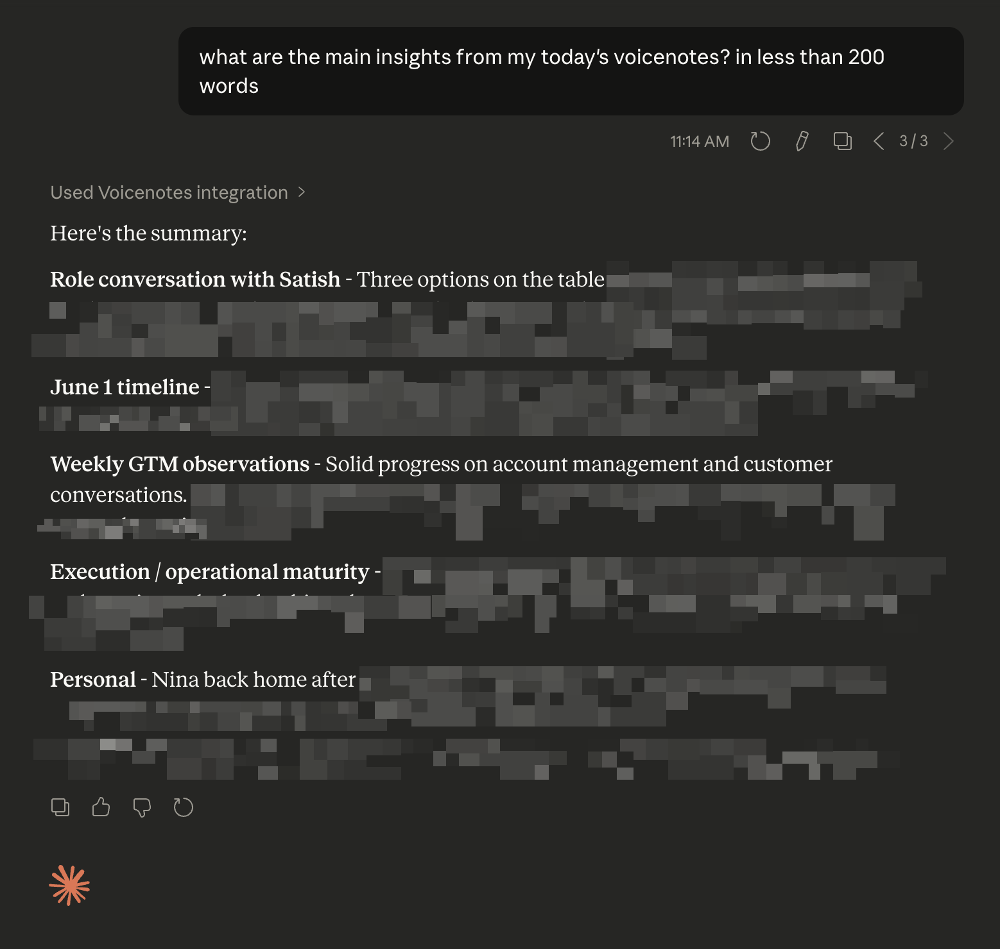

# voicenotes-mcp

MCP server for [VoiceNotes](https://voicenotes.com). Search, browse, and create notes from Claude.

## What you can do

Once connected, you can ask Claude things like:

- "Search my notes for anything about product strategy"
- "What did I capture last week?"
- "Find my notes tagged #meeting from January"
- "Create a note: follow up with John about the proposal"
- "Read me the full transcript of that note about the Q4 review"

Claude will search semantically, not just by keyword, so "ideas about hiring" will surface relevant notes even if you never used those exact words.



## Setup

First, get your VoiceNotes API key at [voicenotes.com/app#settings](https://voicenotes.com/app?open-claw=true#settings).

A hosted server is available at:
```
https://mcp-voicenotes-production.up.railway.app/{your_api_key}/mcp
```

> Provided as a convenience. No uptime guarantees. Self-host if you need reliability.

### Claude.ai (web) and Claude Desktop

Go to **Settings > Connectors > +** and enter:

- **Name**: Voicenotes
- **Remote MCP server URL**: `https://mcp-voicenotes-production.up.railway.app/{your_api_key}/mcp`

### Claude Code

Add to `~/.claude.json` under `mcpServers`:

```json
"voicenotes": {
  "type": "http",
  "url": "https://mcp-voicenotes-production.up.railway.app/{your_api_key}/mcp"
}
```

Then run `/mcp` and hit **Reconnect** (not Authenticate).

## Tools

### `search_notes(query)`
Semantic search across your notes. Returns results ordered by relevance with title, ID, tags, and a preview.

- `query` (required) — natural language search string

### `list_notes(tags?, start_date?, end_date?, page?)`
List notes with optional filters.

- `tags` — array of tag names, e.g. `["meeting", "idea"]`
- `start_date` / `end_date` — ISO date strings, e.g. `"2026-01-01"`
- `page` — page number, 10 results per page (default: 1)

### `get_note(uuid)`
Fetch the full transcript and metadata of a note.

- `uuid` (required) — 8-character note ID, e.g. `"YRjeZkMc"`

### `create_note(content)`
Create a new text note.

- `content` (required) — the note body

## VoiceNotes API

This server uses the VoiceNotes integrations API:

| Endpoint | Method | Purpose |
|----------|--------|---------|
| `/api/integrations/open-claw/search/semantic` | GET | Semantic search |
| `/api/integrations/open-claw/recordings` | POST | List with filters |
| `/api/integrations/open-claw/recordings/{uuid}` | GET | Fetch single note |
| `/api/integrations/open-claw/recordings/new` | POST | Create text note |

All requests are authenticated with your VoiceNotes API key via the `Authorization` header.

## Self-hosting

```bash
git clone https://github.com/samlevan/voicenotes-mcp
cd voicenotes-mcp
railway link
railway up
```

No env vars required. The VoiceNotes API key is passed in the URL path at request time.
